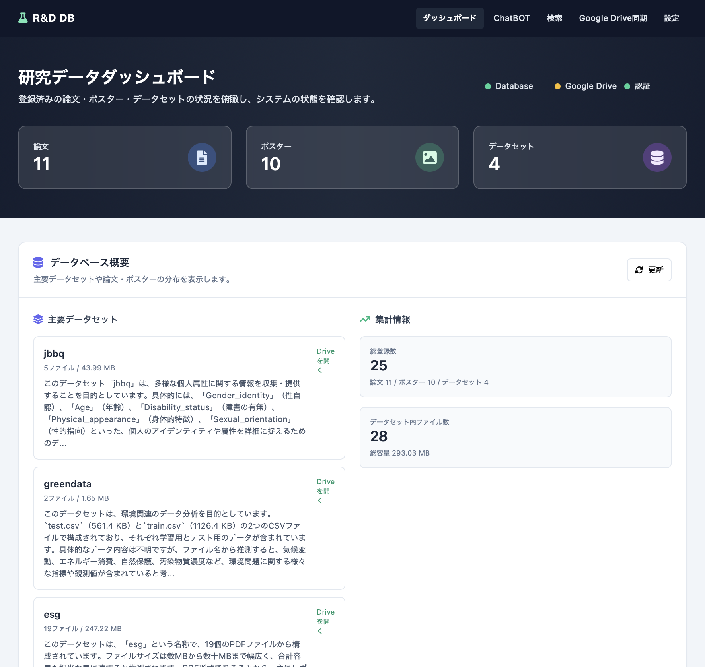
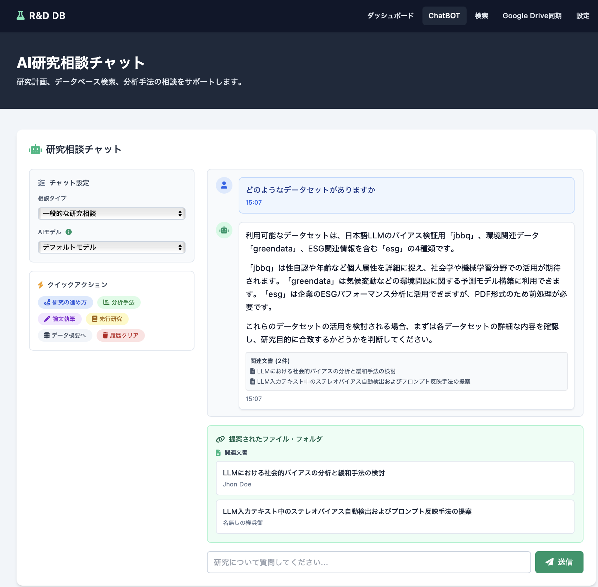
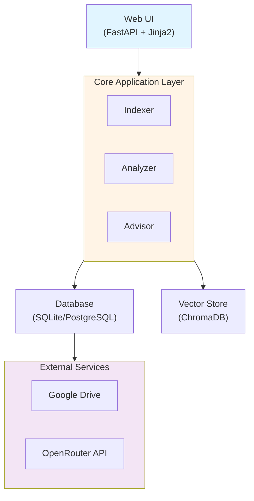
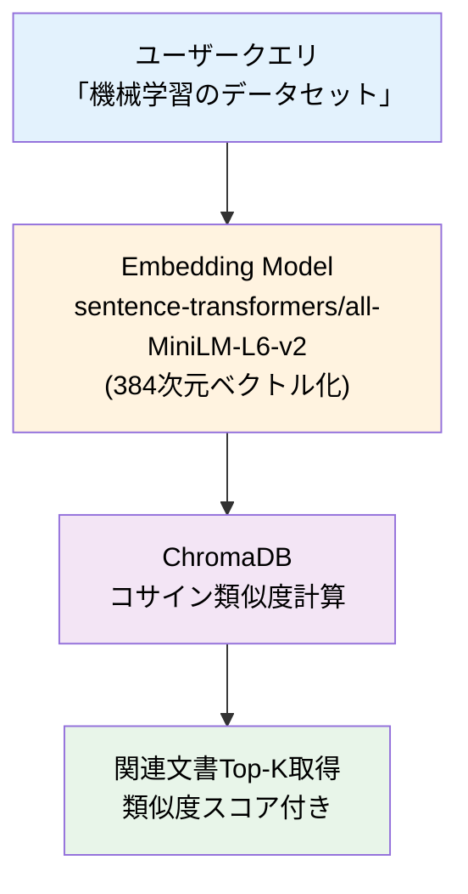
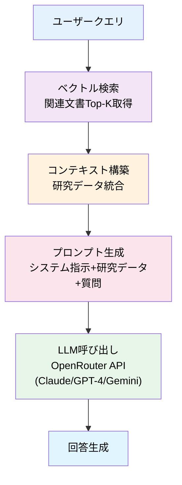

# 研究データ管理システム - R&D DB

<!--  -->

**Google Drive連携 & AI研究相談を備えた研究データ管理システム**

## システム概要

### 主要機能

このシステムは以下の3つの主要な機能を持っています。

**1. Google Drive連携による自動データ管理**

Google Driveに保存された研究データを自動的に同期・解析し、メタデータを抽出してデータベースに格納します。

**2. セマンティック検索（ベクトル検索）**

キーワードだけでなく、意味的な関連性に基づいて論文やデータセットを検索できます。

**3. AI研究相談（RAG + LLM**

データベース内の研究データをコンテキストとして、LLMが的確な研究アドバイスを提供します。


### 提供できる価値

以上の機能により、組織のデータ格納基盤として使われることの多いGoogle Driveを基礎にしつつ、研究にまつわるデータのInputを楽に行えるようにしつつも、Outputも自然言語で行えるようになり、研究の手間を最小限にします。

---

## 動作イメージ

### ダッシュボード



システム全体の統計情報とデータベースの状態をリアルタイムで確認できます。

### AI研究相談



研究に関する質問をすると、データベース内の関連データを参照しながらAIが回答します。

---

## このシステムの作成背景

研究活動において、論文、データセット、ポスターなどの研究成果物は日々増え続けます。
しかし、これらのデータは散在しがちで、以下のような課題がありました：

- **データの所在が分からない**: 「あのデータセット、どこに保存したっけ？」
- **関連性の把握が困難**: 「この論文に使われているデータセットはどれ？」
- **検索の非効率性**: ファイル名だけでは内容を理解できない
- **研究相談の不在**: 深夜や休日に研究の方向性を相談できる相手がいない

このシステムは、これらの課題を**Google Drive連携**と**AI技術（RAG + LLM）**で解決し、研究者が本来の研究に集中できる環境を提供します。

---

## 技術スタック

### バックエンド

| 技術 | バージョン | 選定理由 |
|------|-----------|---------|
| **Python** | 3.11+ | 豊富なデータ処理・ML/AIライブラリ |
| **FastAPI** | - | 高速な非同期処理、自動APIドキュメント生成 |
| **SQLite** | - | 開発環境での軽量なデータ永続化 |
| **PostgreSQL** | - | 本番環境でのスケーラブルなDB |
| **ChromaDB** | - | ベクトル検索のためのローカルDB |
| **sentence-transformers** | all-MiniLM-L6-v2 | 軽量かつ高精度な埋め込みモデル |

### LLM API統合

| サービス | 用途 |
|---------|------|
| **OpenRouter API** | Claude, GPT-4等の複数LLMへの統一アクセス |
| **Google Gemini API** | 論文・データセット解析（レガシー実装） |

### フロントエンド

| 技術 | 用途 |
|------|------|
| **TailwindCSS** | モダンでレスポンシブなUI構築 |
| **Jinja2** | サーバーサイドテンプレート |
| **Chart.js** | データ可視化 |

### 外部サービス連携

| サービス | 用途 |
|---------|------|
| **Google Drive API** | クラウドストレージ連携・自動同期 |
| **OAuth 2.0** | セキュアなユーザー認証 |

---

## アーキテクチャとディレクトリ構造

### システムアーキテクチャ



### ディレクトリ構造

``` text
/
├── app/                          # メインアプリケーション
│   ├── main.py                   # FastAPIエントリーポイント
│   ├── core/
│   │   └── context.py            # シングルトンコンテキスト管理
│   ├── routers/
│   │   └── pages.py              # ページルーティング
│   └── schemas/
│       └── api.py                # APIスキーマ定義
│
├── agent/source/                 # コアビジネスロジック
│   ├── database/                 # データベース層
│   │   ├── connection.py         # DB接続管理
│   │   ├── new_models.py         # データモデル
│   │   └── new_repository.py     # リポジトリパターン実装
│   │
│   ├── indexer/                  # ファイルインデクサー
│   │   ├── new_indexer.py        # ファイルスキャン・登録
│   │   └── scanner.py            # ファイルシステムスキャナー
│   │
│   ├── analyzer/                 # AI解析エンジン
│   │   ├── new_analyzer.py       # メタデータ抽出
│   │   ├── gemini_client.py      # Gemini APIクライアント
│   │   └── openrouter_client.py  # OpenRouter APIクライアント
│   │
│   ├── advisor/                  # AI研究相談
│   │   ├── dataset_advisor.py    # データセット推薦
│   │   └── enhanced_research_advisor.py  # RAG統合アドバイザー
│   │
│   ├── integrations/             # 外部サービス統合
│   │   ├── google_drive.py       # Google Drive連携
│   │   ├── vector_search.py      # ベクトル検索
│   │   ├── vector_indexer.py     # ベクトルインデックス管理
│   │   ├── auth.py               # 認証管理
│   │   └── looker_export.py      # データエクスポート
│   │
│   └── interfaces/               # 抽象化レイヤー（並行開発用）
│       ├── data_models.py        # 共通データ型
│       ├── auth_ports.py         # 認証インターフェース
│       └── fastapi_auth_middleware.py  # 認証ミドルウェア
│
├── services/                     # サービス層
│   ├── rag_interface.py          # RAG統合インターフェース
│   ├── admin_metrics.py          # 管理者メトリクス
│   └── api/                      # HTTP APIサーバー
│       ├── paas_api.py           # 開発用API（認証なし）
│       └── paas_api_with_auth.py # 本番用API（認証あり）
│
├── templates/                    # HTMLテンプレート
│   ├── base.html
│   ├── dashboard.html
│   ├── chat.html
│   ├── search.html
│   └── drive_sync.html
│
├── static/                       # 静的ファイル（CSS/JS/画像）
├── data/                         # 研究データ
│   ├── datasets/                 # データセット（CSV/JSON/JSONL）
│   ├── paper/                    # 論文PDF
│   └── poster/                   # ポスターPDF
│
├── chroma_db/                    # ベクトルDB永続化
├── credentials/                  # 認証情報（.gitignore）
├── docs/                         # ドキュメント
├── scripts/                      # ユーティリティスクリプト
└── tools/
    └── config.py                 # 設定ファイル
```

### 設計の特徴

#### 1. レイヤードアーキテクチャ

- **プレゼンテーション層**: FastAPI + Jinja2によるWebUI
- **ビジネスロジック層**: agent/source/内のコアモジュール
- **データアクセス層**: リポジトリパターンによるDB抽象化

#### 2. シングルトンコンテキスト管理

`app/core/context.py`で全コンポーネントを一元管理し、依存性注入を実現。

#### 3. ポート&アダプターパターン

`agent/source/interfaces/`で抽象化レイヤーを提供し、外部サービスの差し替えを容易に。

#### 4. 非同期処理

FastAPIの非同期機能を活用し、Google Drive同期やLLM API呼び出しをブロッキングせずに実行。

---

## 主要機能の技術的詳細

### 1. Google Drive連携

#### 自動ファイル同期

- フォルダ構造認識（`datasets/`, `paper/`, `poster/`）
- ファイルハッシュによる重複排除
- メタデータの自動保存（Google Drive URL含む）

#### 実装の工夫

- **リトライ機構**: API制限に対する指数バックオフ
- **バッチ処理**: 大量ファイルの効率的な処理
- **差分同期**: 変更されたファイルのみを更新

### 2. ベクトル検索（RAG）

#### セマンティック検索の仕組み



#### ハイブリッド検索

ベクトル検索が利用不可の場合、TF-IDFによるキーワード検索にフォールバック。

### 3. AI研究相談（RAG + LLM）

#### RAGパイプライン



**実装コード例：**

```python
def research_consultation(query: str) -> str:
    # 1. ベクトル検索で関連文書を取得
    relevant_docs = vector_search(query, top_k=5)

    # 2. コンテキストを構築
    context = build_context(relevant_docs)

    # 3. LLMにプロンプトを送信
    prompt = f"""
    あなたは研究アドバイザーです。
    以下の研究データを参照して質問に答えてください。

    【研究データ】
    {context}

    【質問】
    {query}
    """

    # 4. OpenRouter API経由でLLM呼び出し
    response = openrouter_client.chat(prompt)

    return response
```

#### スマート関連性フィルタリング

- **キーワード抽出**: クエリから重要キーワードを抽出
- **ストップワード除去**: 一般的すぎる単語を除外
- **スコアリング**: 関連性スコアに基づいて推薦精度を向上
- **閾値フィルタリング**: スコア5以上のアイテムのみ表示

### 4. マルチLLMプロバイダ対応

#### OpenRouter API統合

単一のAPIで複数のLLMモデルを利用可能：

- Claude 3.5 Sonnet
- GPT-4
- Gemini 2.0 Flash

#### モデル自動同期

24時間ごとにOpenRouterのモデル一覧を自動取得し、データベースに保存。
